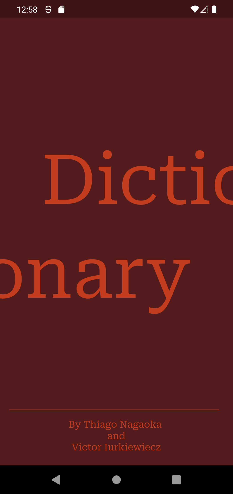
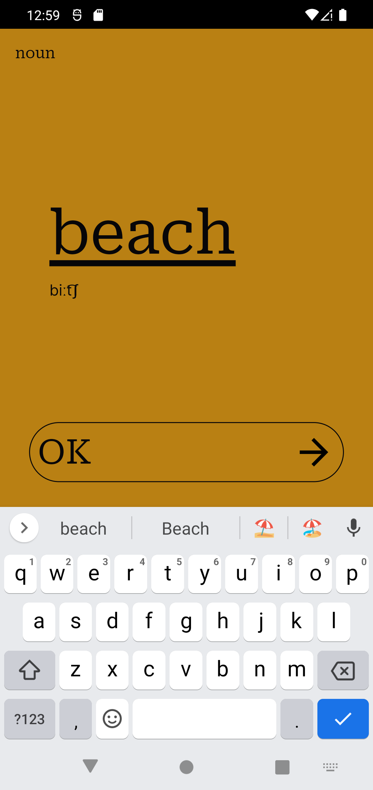
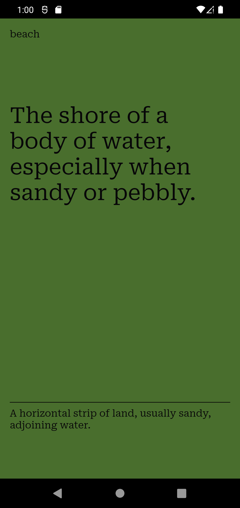

# Dictionary App

This project was proposed on a training course organized by Snowman Labs. Its main purpose was to study Flutter Modular and build it using an scalable architecture. This app consumes a public API, its url is: https://dictionaryapi.dev/. It allows us to search an english word and brings us its meaning.

It was developed by Victor Iurkiewiecz and Thiago Nagaoka.

When you open our app, you will see our landing page. It is illustrated in the image bellow.



If you tap on the screen, you will be redirected to our homepage, it is where you type a word that you would like search. It is shown in the image bellow.



When you tap on the "OK" button, you will be redirected to our description page, where you will see the meaning of the word typed on previous page. It is illustrated in the image bellow.



## Getting Started

If you would like to collaborate or just run this app on your computer, remember that you need to have this items on your Desktop:

- Dart
- Flutter
- Visual Studio Code
- Android Studio
- XCode (MacOS)

Also, you need to have this flutter public packages:

- Flutter Mobx
- Mobx Codegen
- Mobx
- Flutter Modular
- Dio
- Lottie
- Google Fonts
- Build Runner

And then you need to run the following command in your terminal:

```
git clone https://github.com/Victoriurki/dictionary_app.git
```